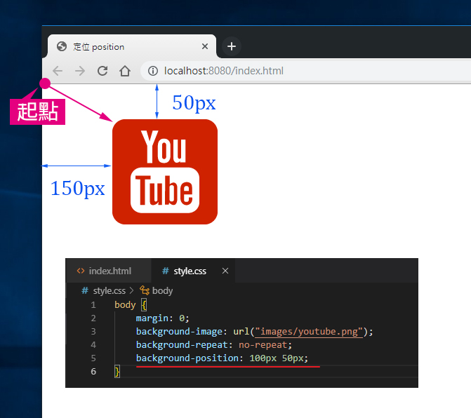
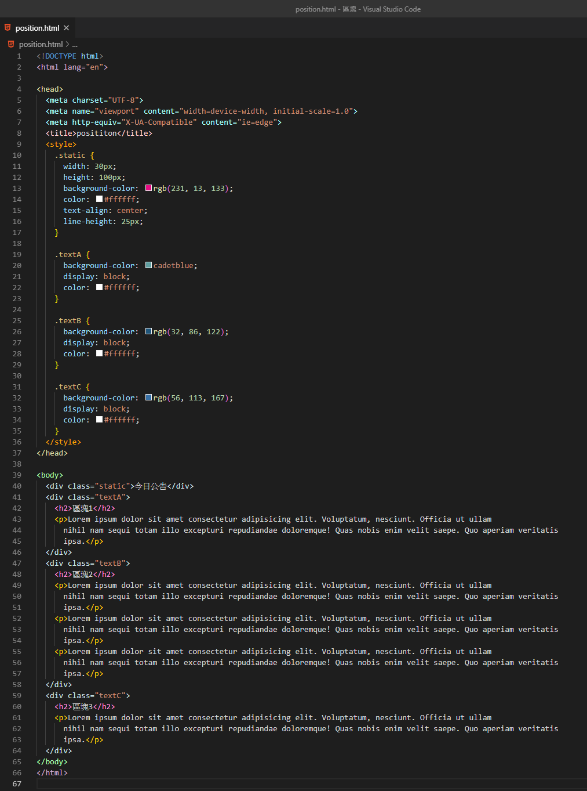

# background-position

### background-position設定背景位置

CSS的背景屬性background-position 分成三種表示方式：關鍵字、像素、百分比

* 關鍵字：`background-position:top left;`　值有top、bottom、left、right、center
* 像素：`background-position:20px 20px;`
* 百分比：`background-position:0% 0%;`

**關鍵字位置**

 **水平方向：**left - 靠左對齊、center - 置中對齊、right - 靠右對齊

 **垂直方向：**top - 靠上對齊、center - 置中對齊、bottom - 靠下對齊

**關鍵字與像素兩者都是指定圖片左上角，相對於容器位置的左上角**




```css
background-attachment: fixed; /*寫入這一行，才能讓圖片在Firefox 和 Chrome 正常出現你要的位置*/
```


```css
background-position:right top;　// 靠右靠上對齊
background-position:right center;　// 靠右置中對齊
background-position:right;　// 靠右置中對齊(如果您僅定義了一個參數，那麽第二個參數將會默認為「center(置中)」。)
background-position:right bottom;　// 靠右靠下對齊
background-position:left top;　// 靠左靠上對齊
background-position:left center;　// 靠左置中對齊
background-position:left;　// 靠左置中對齊(如果您僅定義了一個參數，那麽第二個參數將會默認為「center(置中)」。)
background-position:left bottom;　// 靠左靠下對齊
background-position:top center;　// 靠上置中對齊
background-position:bottom center;　// 靠下置中對齊
background-position:center;　//背景圖片水平位置與垂直位置均置中對齊

background-position:50px 150px;　//靠左 50px 靠上 150 px 的位置(第一個值是水平位置)
background-position:10% 50%;　// 靠左 10% 靠上 50% 的位置(第一個值是水平位置，第二個值是垂直位置。)
background-position:10%;　// 效果同上一行，靠左 10% 靠上 50% 的位置 (如果您僅規定了一個值，另一個值默認為 50%。)
```

若以**px** 或 **%** 表示時，數值可以用負的。下圖就是背景圖片往左移-10px  往上移-30px。

_**背景圖片只能顯示在網頁容器裡面，超出容器就會被切掉。**_


背景屬性也可以有背景圖片也有背景顏色!



