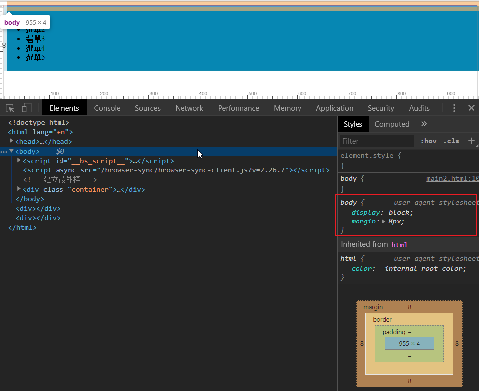

# Position運用在網頁上

Position 在網頁拼板上，很常運用到。

### 建立網頁最外部框架

會看到右邊預覽只有一條紅線，因為外框裡面沒有塞東西進去，版面還沒有撐起來。


建立ul選單


一開始&lt;body&gt;都有預設**8像素的空隙**，這會導致網頁都會無法貼其瀏覽器，所以要將瀏覽器默認的設定重置，所以要在body上面下重置語法。

```css
 body{ 
 margin: 0; 
 padding: 0; 
 }
```



瀏覽器在很多元素上面都有默認的屬性，例如: li 、 input 、 table 、 ol...等，做網頁開始，會有習慣全部重置，網路上已經有人寫好CSS reset ，我們只要引入或是外部連結進網頁就可以了。

[https://meyerweb.com/eric/tools/css/reset/](https://meyerweb.com/eric/tools/css/reset/)

將nav加入背景色比較容易識別，並讓選單靠上靠左貼其瀏覽器。


讓選單呈現水平排列

```css
 /* 選單 */
    nav {
      position: fixed;
      width: 100%;
      border: solid 2px #1288ac;
      display: block;
      background-color: rgb(6, 135, 179);
      top: 0;
      left: 0;
    }

    nav ul {
      list-style: none;
    }

    nav ul li {
      display: inline-block;
      width: 150px;
      height: 50px;
      background-color: rgb(255, 254, 180);
      margin: 10px;
    }
```


製作Banner橫幅，把圖片叫進網頁中，圖片叫進來，並不會符合瀏覽器的寬度，所以要設定img的寬度。


```css
section {
  position: relative;
}
.banner {
  position: relative;
  top: 104px;
}
.banner img {
  width: 100%;
}
.title {
  position: absolute;
  color: #ffffff;
  top: 50px;
  left: 300px;
}
```


網頁內容左右設距離

```css
.content {
  padding: 150px 200px;
}
```


```css
footer {
  position: fixed;
  bottom: 0;
  left: 0;
  height: 70px;
  background-color: rgb(201, 201, 201);
  width: 100%;
  text-align: center;
}
```


