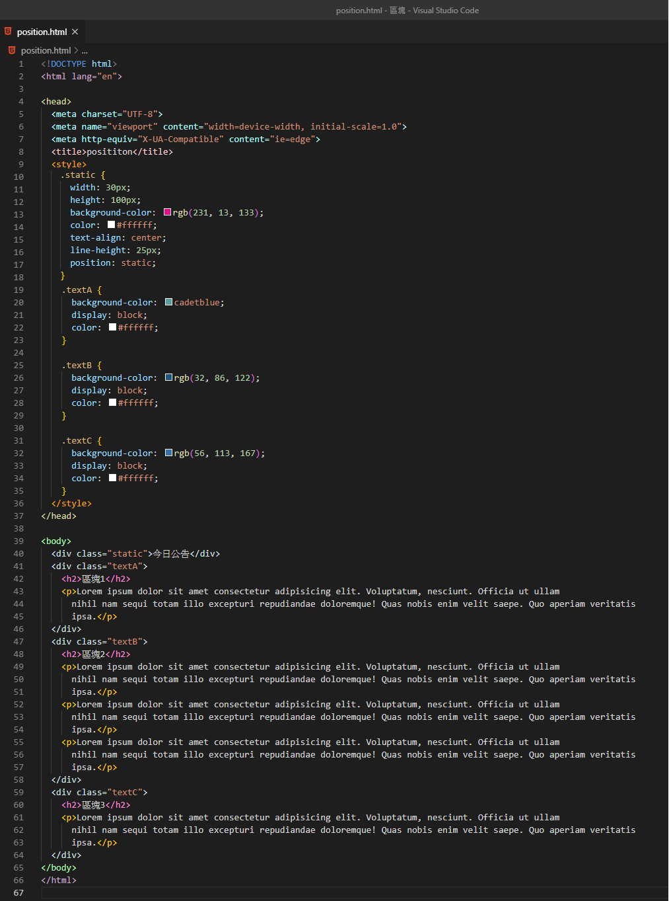

# Position

Position屬性元素有以下幾種

* static 
* relative
* absolute
* fixed
* inherit

### static

預設值，沒有定位，也就是一般配置。只會照著瀏覽器預設的配置自動排版在頁面上，無法用top、bottom、left、right 、z-index來做定位。

```css
.static {
      width: 30px;
      height: 100px;
      background-color: rgb(231, 13, 133);
      color: #ffffff;
      text-align: center;
      line-height: 25px;
      position: static;
    }
```




## relative 相對定位

定位表現起始會和static 一樣，但可以給與其他額外屬性設定，top、left、right、bottom，不會影響其他元素原本所在的位置。


```css
  .relative {
      width: 30px;
      height: 100px;
      background-color: rgb(231, 13, 133);
      color: #ffffff;
      text-align: center;
      line-height: 25px;
      position: relative;
      left: 150px;
      top: 100px;
    }
```


### absolute 絕對定位

absolute會相對於它的父元素進行定位元素定位，如果沒有父元素則會以網頁最外層也就是&lt;body&gt;，左上角的絕對位置來定位。

```css
.absolute {
      width: 30px;
      height: 100px;
      background-color: rgb(231, 13, 133);
      color: #ffffff;
      text-align: center;
      line-height: 25px;
      position: absolute;
      right: 50px;
      top: 100px;
    }
```


